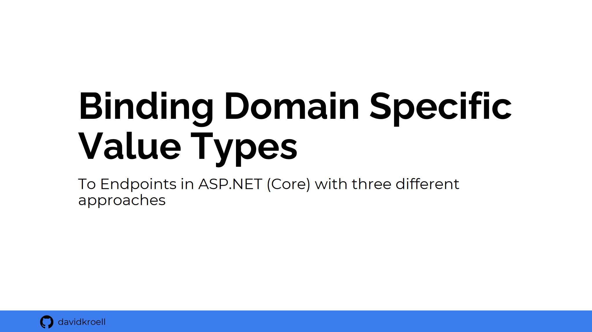

### Abstract

ASP.NET is the leading web framework in the .NET (Core) environment.
During this talk we will explain how to bind **Domain Specific Value Types** directly to Controller endpoints.
We will work through three different approaches to tackle this problem.
Furthermore, we'll take a peek under the hood of ASP.NET,
and finally we will examine the topic in the perspective of software architecture.

### Abstract (german):

ASP.NET ist das führende Webframework im .NET (Core) Umfeld. 
In diesem Talk werden wir uns anschauen, wie man **Domain Specific Value Types** direkt in Controller-Endpunkte binden kann.
Drei verschiedene Herangehensweisen werden dabei erarbeitet und
zusätzlich wagen wir einen Blick unter die Haube von ASP.NET.
Zuletzt wird das Thema noch im Kontext der SW-Architektur beleuchtet.

### Notes
This repository contains all the sources for the presentation mentioned above.

